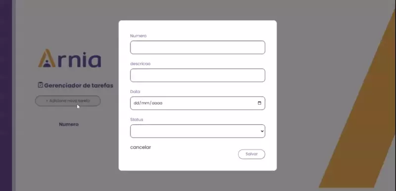

<h1> Projeto Gestor de tarefas<h1>

 

<h2> Sobre o projeto</h2>

https://odarajs.github.io/Gestor-de-tarefas/teste-crud.html

Projeto foi realizado durante curso de front-end, missão do projeto Gestor de tarefas, foi incrível realizar esse projeto, obtive uma experiência maior em javascript, concluir com sucesso o projeto

# Tecnologias utilizadas
## Front end
- HTML / CSS / JS /

# Autor

ALAN MARCELO DE ALMEIDA

https://www.linkedin.com/in/odarajs/
